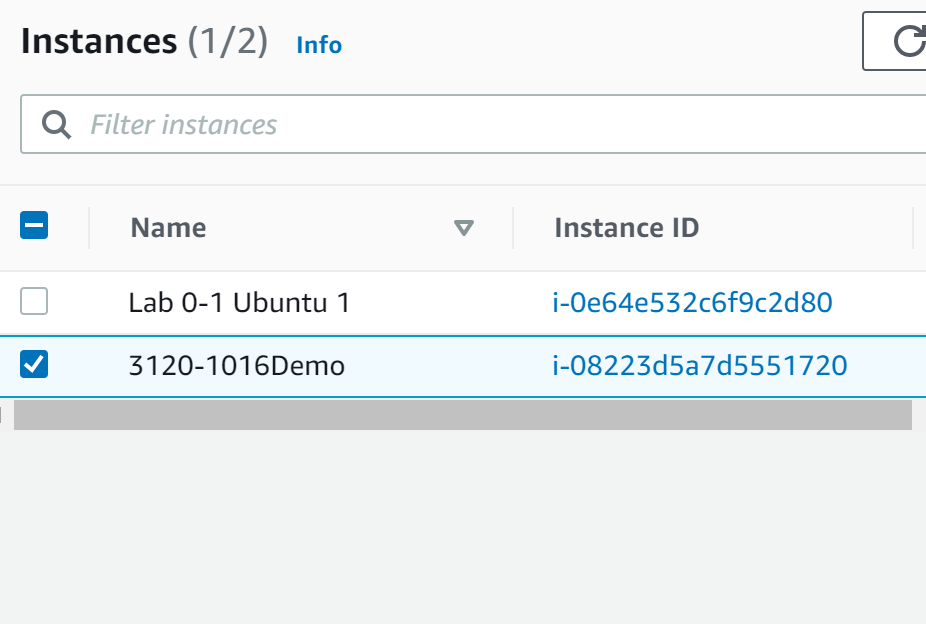

# Project 2-1

## The Story

You've been convinced to join a startup company as their primary (and right now, only) systems admin. It's unclear on what their goal is, but the pay is good, so you're ready for the ride.

While the new CEO runs around looking for developers, you've been tasked with getting some basic infrastructure setup. You will start by building out a directory service (phonebook) and a project repository server. Since the CEO loves linux, they requested that you use SLAPD for the directory service and GitLab as the repository server.

Since you've walked the startup road before, you know to thoroughly document everything. Since email is not a good documentation method, you're going to separately keep track of things on a private GitHub repository.

## Objectives:

- Create a VPC on AWS.
- Create a code repository (GitLab or git server)
  - GitLab AMI - if you go this route, you'll likely be forced to use a t2.medium, which means you are responsible for cost management (spinning down the server when not in use)
  - Ubuntu AMI + manually install git server - in changelog notes, put in what site you followed & any unique configurations. While not "secure" you might also jot down a password hint.
  - REQUIREMENT: screenshot of a repo local and remote repo
- Create an OpenLDAP server
- Attach an IP address to each.
- Install the services on the instances.
- Make networking decisions and open ports appropriately.
  - In VPC, utilize Security Groups to lock down cloud traffic
    - Edit inbound (ports for our services, traffic on 10.0.0.0/16)
    - Outbound does not need to be edited
- ~~Configure GitLab for LDAP authentication~~
  - Making requirement for next part of project

### AWS Educate Quick Link:

- [Sign in to AWS educate](https://www.awseducate.com/signin/SiteLogin)

## Deliverables:

The primary deliverable for this project is a changelog that includes the components listed below. You may do this by using GitHub Projects in your class repository or by manually keeping track of changes. Since we will be building from this project, your log should include a date and/or time implemented. You may choose to break up the tasks into their own changelogs. I would get templating then check with me if you have concerns about your changelog.

I have no preference on if you manipulate your repository via the AWS instance that was created for us or use your repository locally.

### Changelog management includes:

- A record of changes made over time
- Justifications
- Resources used as a template for your installation / configuration
- Screenshot of the result

### Rubric:

### Template changelog:

Note: I tend to think of changelogs as old events sinking to the bottom - therefore most recent changes end up at the top.

# Changelog Project 2

## Server Configurations

### 10/24/2020 Installed git server

- Installed based on guide
- Create git user
- Password hint coursegit
- Setup ssh key on local system, uploaded public key to git user authorized_keys file
- Verified ssh key works by ssh'ing to system
- Put bare repo on remote, cloned local.
- Initialized repo on local, still needed to create bare on remote
  - Had to use `git push -u origin master`
  - TODO: Figure out bare, scp, and the key to happiness.

## Instances on AWS

### 10/15/2020 trashed instance

- GitLab requires more resources (setup on t2.micro server). Tanked system during install.
- Create new instance, taking manual server approach
- Git server IP: 35.153.218.176

### 10/14/2020 created instances

- Created instance from Ubuntu AMI to manually install git server
- Created instance from Ubuntu AMI to create SLADP server  
  

## Configure VPC in AWS

### 10/15/2020 security group update

- Based on security rules from templated AWS system.
- Added inbound rules for SSH (22) traffic
- Need ports x open for SLADP and x open for GitLab.  
  [screenshot of security group rules]

### 10/14/2020 creation

- Created VPC via wizard with default network rules
- VPC id: vpc-07021ac52230b011f
  [screenshot of VPC]
